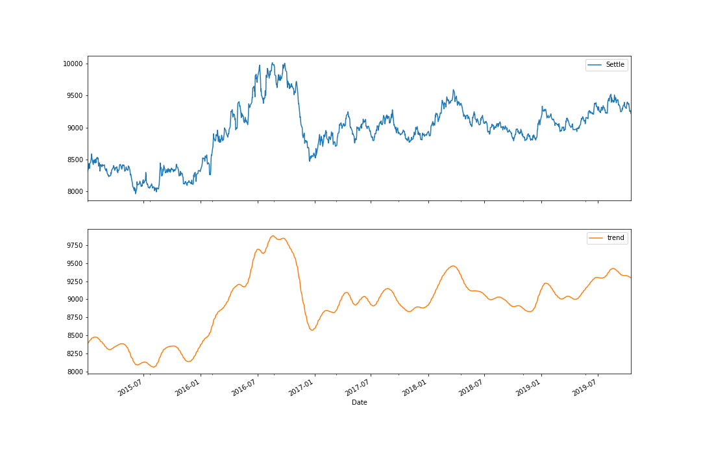
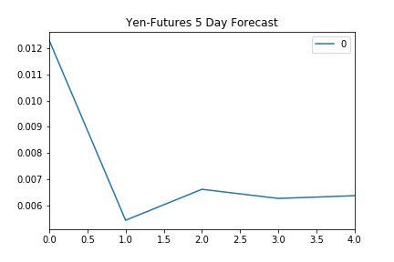
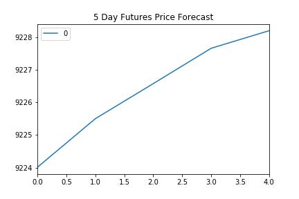
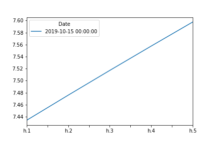
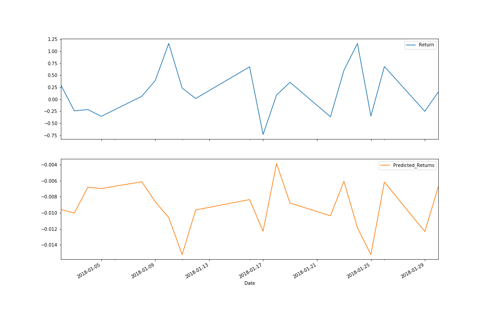
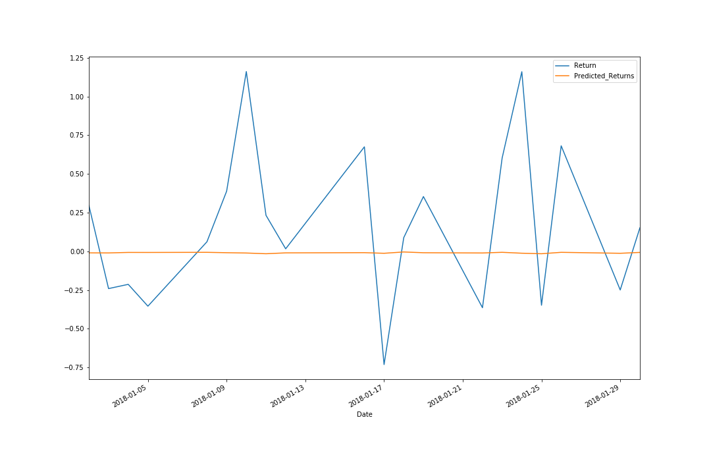

# Time Series and Regression analysis of Yen futures from 2015 - 2019
 - Use different models to forecast Yen Futures prices.
     - Hodrick-Prescott Filter
     - ARMA model
     - ARIMA model
     - Linear Regression
     
## Hodrick-Prescott Filter (HPfilter)
The HPfilter is used to isolate a trend from noise within data and illustrate any points of possible seasonality within a time series. The trading data for Yen prices against the USD does not show any particular seasonality from the trend data, seen below:

## Auto-regressive Moving Average (ARMA)
The ARMA model is used to provide a 5-day forecast the of the percent returns.

The forecast shows the returns are positive for the next 5 days, however the model score indicates a high level of errors.
- AIC of 15798.142 
- BIC of 15832.765

## Auto-regressive Integrated Moving Average (ARIMA)
The ARIMA model is used to provide a 5-day forecast of the price of the Yen.

The forecast shows prices from 9224.00 - 9228.00, however the model score indicates an even higher level of errors than the ARMA model.
- AIC 83905.238
- BIC 83960.635

## Generalized Autoregressive Conditional Heteroskedasticity (GARCH)
The GARCH model is used to predict the amount of short-term volitility in a series.

The forecast shows an increase in volatility, however, even this model suffers from high levels of errors
- AIC: 14931.9
- BIC: 14959.6

Define - [Heteroskedasticity](https://www.investopedia.com/terms/h/heteroskedasticity.asp)

## Regression Analysis
Finally, a linear regression is performed on the Yen futures by creating a lag of one trading day, and adding that to the data.  The analysis shows that the linear regression holds to some of the variability of the data, however the scale of changes is compressed dramatically.

Unfortunately, this leads the model to a high level of error, which makes useful forecasting difficult.

I would not use these models alone to make predictions on Yen futures, but they do provide a useful starting point for more targeted analysis.
